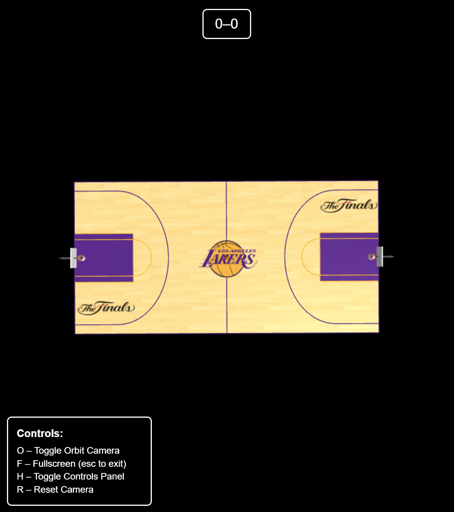
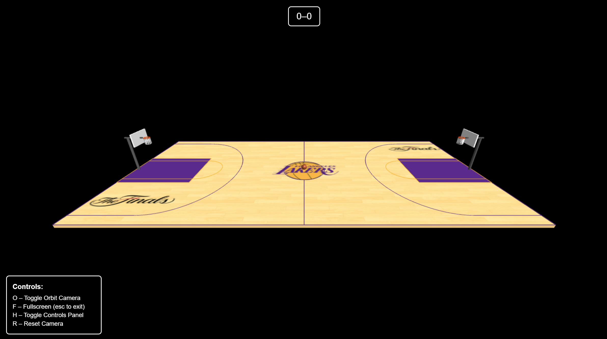
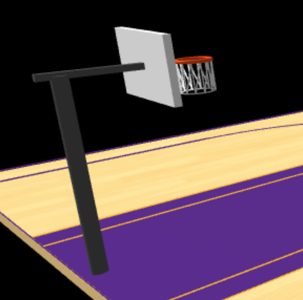
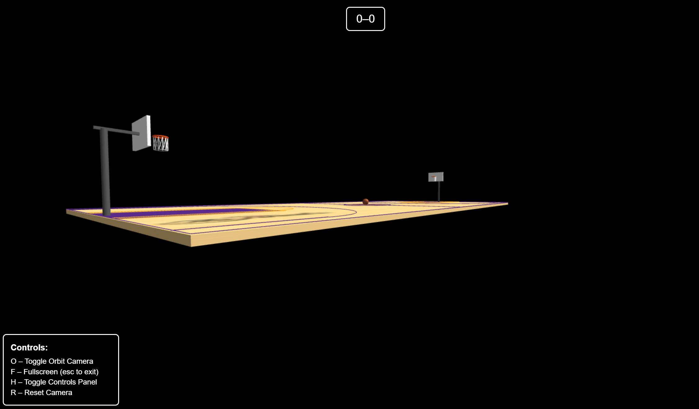
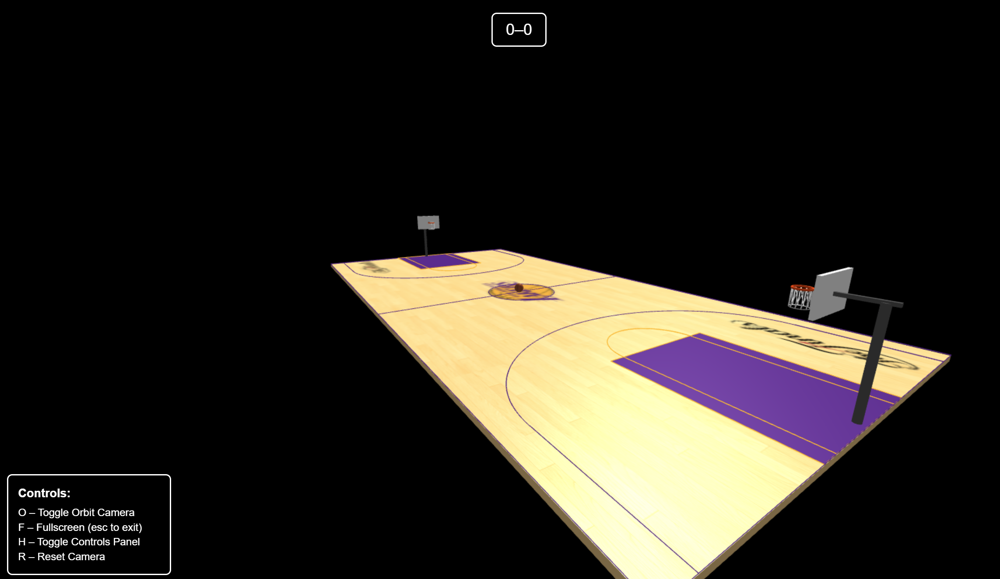

# Computer Graphics - Exercise 5 - WebGL Basketball Court

## Getting Started
1. Clone this repository to your local machine
2. Make sure you have Node.js installed
3. Start the local web server: `node index.js`
4. Open your browser and go to http://localhost:8000

## Complete Instructions
**All detailed instructions, requirements, and specifications can be found in:**
`basketball_exercise_instructions.html`

## Group Members
**MANDATORY: Add the full names of all group members here:**
- Rotem Lida
- Barak Kristal

## How To Run The Implementation
- Run the server with: `node index.js`
- Access at http://localhost:8000 in your web browser

## Complete List of Implemented Controls
- **Arrow Keys**: Move basketball horizontally and forward/backward on the court (with boundary checks)
- **W / S Keys**: Increase (W) or decrease (S) shot power (0-100%)
- **Spacebar**: Shoot basketball toward the nearest hoop using current shot power and position
- **R Key**: Reset basketball to center court and clear physics state
- **O Key**: Toggle orbit camera controls on/off
- **F Key**: Toggle fullscreen mode
- **H Key**: Show/hide controls panel
- **C Key**: Reset camera to starting position

## Description of Physics System Implementation
The basketball game implements a realistic, time-based physics system using the following principles:

- **Gravity:** The basketball is affected by a constant downward acceleration (gravity = -9.8 m/s², scaled for the scene). This creates a natural parabolic arc for all shots.
- **Trajectory Calculation:** When the spacebar is pressed, the game calculates the required initial velocity for the ball to reach the center of the nearest hoop, factoring in the current shot power and the distance to the rim. The shot always targets the rim center, and the arc peak is set above the rim for realism.
- **Shot Power:** The shot power (0-100%) directly affects the initial velocity of the ball. A dynamic "sweetspot" is calculated for each shot based on distance, and only shots within this range have a high chance of success.
- **Ball Movement:** The ball's position is updated every frame using its velocity and the elapsed time (delta time), ensuring frame-rate independence.
- **Collision Detection:**
    - **Ground:** The ball bounces off the ground with energy loss (coefficient of restitution < 1), and comes to rest after several bounces.
    - **Court Boundaries:** The ball is clamped within the court boundaries during movement and flight.
    - **Rim/Hoop:** The system checks if the ball passes through the rim area from above (with a downward trajectory) to detect made shots. The ball must be within a certain radius of the rim center and at the correct height.
- **Ball Rotation:** The basketball rotates during both ground movement and flight. The rotation axis matches the movement direction, and the speed is proportional to the ball's velocity, creating a realistic spinning effect.
- **Event-Based Logic:** All physics and stat updates are event-driven and use time-based calculations, ensuring consistent behavior at any frame rate (including 60 FPS).

## Additional Features Implemented
- NBA2K-style shot meter HUD with dynamic green "sweetspot" for perfect shots
- Multiple Hoops: Allow shooting at both hoops with automatic targeting
- Differentiates between 2-point and 3-point shots: The system automatically detects if a shot is from beyond the 3-point line and tracks 3PA/3PM stats separately.
- Visual feedback:
    - Animated "SHOT MADE!" and "MISSED SHOT" messages
    - Confetti/particle effect on made shots
- Enhanced UI polish:
    - Animated score flash on scoreboard
    - Responsive layout and unified CSS styling
    - Controls panel can be shown/hidden (H key)
    - Fullscreen toggle (F key)
    - Camera reset (C key)
- Robust, event-based stat tracking (frame-rate independent, prevents double-counting)
- Debug logging for shot events and stat increments (for development)
- All Lakers court features from HW05 retained:
    - Lakers logo at center circle
    - NBA Finals logo
    - Wooden floor texture
    - Purple/gold court outlines and paint

## Known Issues Or Limitations
- Court lines purple to allign with lakers actual styling
- No Net Physics: The net is visual only; it does not interact with the ball.

## External Assets Sources Used
- Ball and floor textures were generated by ChatGPT
- Lakers logo and finals logo were generated by chatGPT
- Court dimentions: https://www.dimensions.com/element/basketball-court

## Screenshots
- Overall view:

- Hoop Closeup:

- Basketball at center court

- Camera controls functionality

## See the Video Demo! In this repo - basketball-demo.mkv
