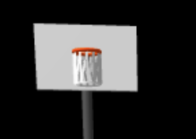

# Computer Graphics - Exercise 5 - WebGL Basketball Court

## Getting Started
1. Clone this repository to your local machine
2. Make sure you have Node.js installed
3. Start the local web server: `node index.js`
4. Open your browser and go to http://localhost:8000

## Complete Instructions
**All detailed instructions, requirements, and specifications can be found in:**
`basketball_exercise_instructions.html`

## Group Members
**MANDATORY: Add the full names of all group members here:**
- Rotem Lida
- Barak Kristal

## How To Run The Implementation
- Run the server with: `node index.js`
- Access at http://localhost:8000 in your web browser

## Additional Features Implemented
- Full screen viewing
- Reset camera to starting position
- Hide controls panel
- Resize handler
- Lakers court features:
    - Lakers Logo at center circle
    - NBA finals logo
    - Wooden floor texture
    - Court outlines
    - Painted area, outlines and innerlines
    - Freethrow line
    - Regulated three point lines

## Known Issues Or Limitations
- Court lines purple to allign with lakers actual styling

## External Assets Sources Used
- Ball and floor textures were generated by ChatGPT
- Lakers logo and finals logo were generated by chatGPT
- Court dimentions: https://www.dimensions.com/element/basketball-court

## Screenshots
- Overall view:

- Hoop Closeup:

- Basketball at center court

- Camera controls functionality

